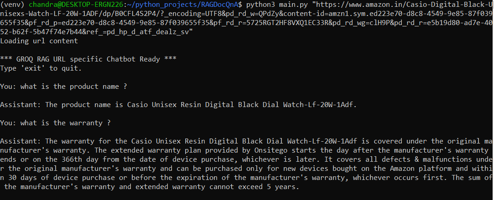
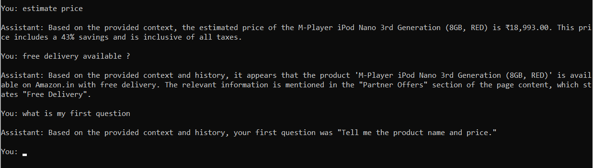

# RAG Chatbot with Memory

A simple, lightweight RAG (Retrieval-Augmented Generation) chatbot
powered by **Groq** and **LangChain**, with
support for: - Loading data from **any website URL** - Local vector
store using **ChromaDB** - **Chat history memory** - Web scraping +
embeddings + retrieval

## Features

-   Load knowledge from any URL (passed as CLI argument)
-   Automatically scrape, chunk, embed, and index the page
-   Chat with contextual memory
-   Uses Groq's fast Llama-3.1-8B-Instant model
-   RAG pipeline built with LangChain
-   Simple command-line chatbot

## Dependencies

Install dependencies:

``` bash
pip install -r requirements.txt
```

## Environment Setup

Create a `.env` file:

    GROQ_API_KEY=your_groq_api_key_here
    USER_AGENT="Mozilla/5.0"

## How to Run

``` bash
python3 main.py "https://docs.github.com/en/get-started/start-your-journey/hello-world"
```

## How It Works

1.  Load Website
2.  Chunk & Embed
3.  Vector Store
4.  Groq LLM Answer
5.  Memory

---
### Test case screenshots

#### image 1
<p align="left">
  
</p>

#### image 2
<p align="left">
  
</p>

#### image 3
<p align="left">
  
</p>
---
